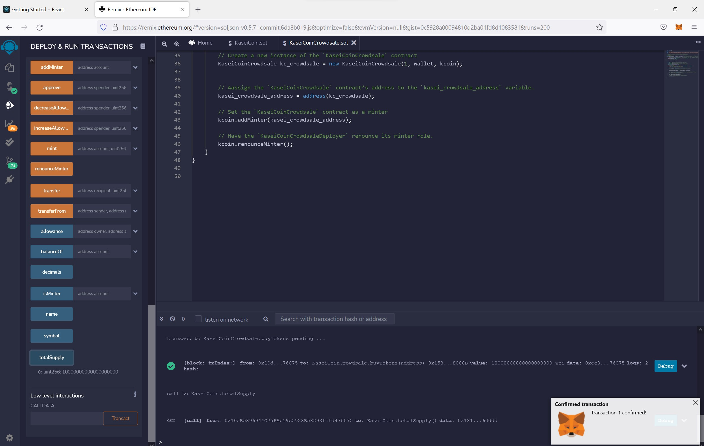

# hw21-KaseiCoin

In this homework, We are going to create a new token, KaseiCoin. 

## Software Development

First, we finished the coding and compilation as shown below:

And the coding of the Kasei Coin Crowdsale contract and the deployment contract is finished and compiled successfully.

Finally, I created a KaseiCoin deployer contract in the provided KaseiCoinCrowdsale.sol starter code.

## Software Testing

1. To the the software, we test by deploying the crowdsale to a local blockchain by using Remix, MetaMask, and Ganache. First we depoly the contracts in the Injected Web3 enviornment to join the Metamask, Ganache, and Remix together in this testing enviornment.

2. Then we depoly first the KaseiCoinDepolyer contract in the injected web3 environment by inputting the token name, symbol, and one of the imported address from Metamask.

3. Navigate to the Deployed Contracts section, and then open the box that’s associated with the KaseiCoinCrowdsaleDeployer contract. Notice that buttons for kasei_crowdsale_address and kasei_token_address now appear.

We link the contracts that’s associated with kasei_crowdsale_address and kasei_token_address to the KaseiCoinCrowdsale contract by completing the following steps:

i. Copy the address that’s associated with kasei_crowdsale_address.

ii. Scroll up to the Contract box, and then select the compiled KaseiCoinCrowdsale.

iii. Copy the address into the At Address box.

iv. Click the At Address button.

Repeat Steps i–iv with kasei_token_address. These steps are demonstrated by the following video

Purchase KaseiCoin from the crowdsale by completing the following steps:

Select a new account from MetaMask. Notice the new account address in the Account box in the Remix IDE. Copy this account address to the clipboard.

In the Value box, we enter 10 ether to determine the number of tokens for this account to purchase.

Navigate to the deployed KaseiCoinCrowdsale contract, paste the address into the buyTokens box, and then click the buyTokens button.

When the MetaMask dialog box opens, click Confirm.

Confirm that the number of purchased tokens is correctly reflected in Remix by clicking the totalSupply button.

Repeat the purchase process by using a third MetaMask address and buy 5 ether of tokens. It is confirmed that the total supply of tokens is correctly reflected in Remix by clicking the totalSupply button.

